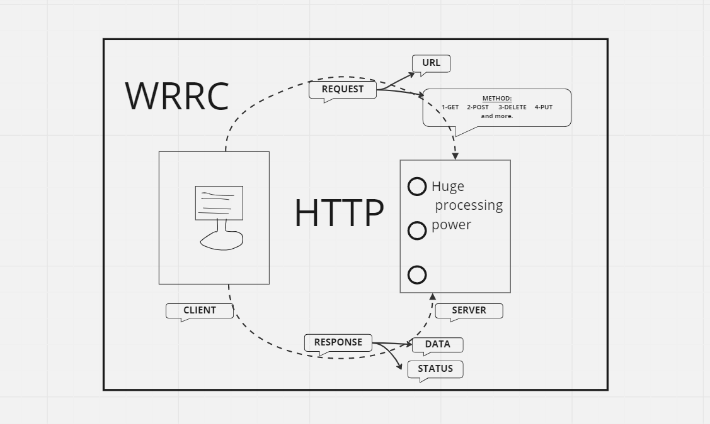

# Movies-Library
# Project Name - Project Version

**Author Name**: Bayan Banat

## WRRC
Add an image of your WRRC here

## Overview
I have used a thunder client to try if my work will
 do if a real client used it and I dealt with a bit of cases.

## Getting Started
<!-- What are the steps that a user must take in order to build this app on their own machine and get it running? -->

prepare youre device, open your terminal and let we doing this steps:
1.`npm init -y` 
2.create `(any file name you want).js` 
3.`npm install express` to install express package to use it in your server
4.run the server using `node (any file name you want).js`

## Project Features
<!-- What are the features included in you app -->

in `server.js`:

--- I have created three routs:
   1-the first rout is: "homePageHandler" with a method of "get" and Endpoint ('/'). this will be show to the client in home page, new data (res.json) containing[{title,poster_path,overview}]
   2-the second rout is: "favoriteHandler" with a method of "get" and Endpoint ('/favorite'). this will be show to the client in Favorite page, this massege (res.send) "Welcome to Favorite Page"
   3-the last rout is: "errorHandler" with a method of "get" and Endpoint ('/error'). this will be show to the client specifiec message related to specifiec status, in this case I dealt with two status(500,404).
   